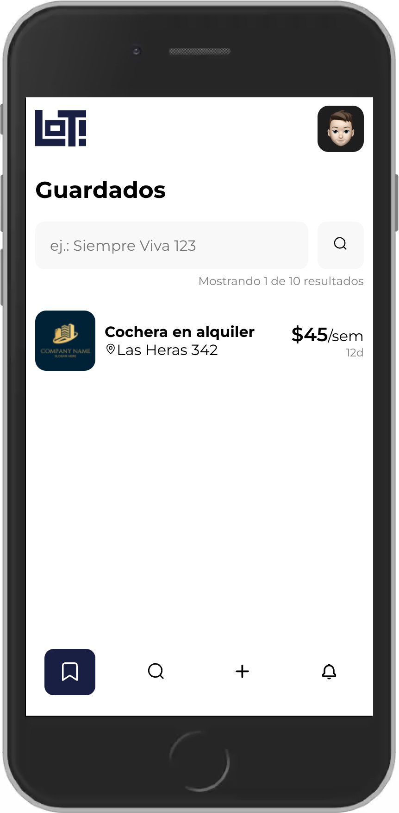
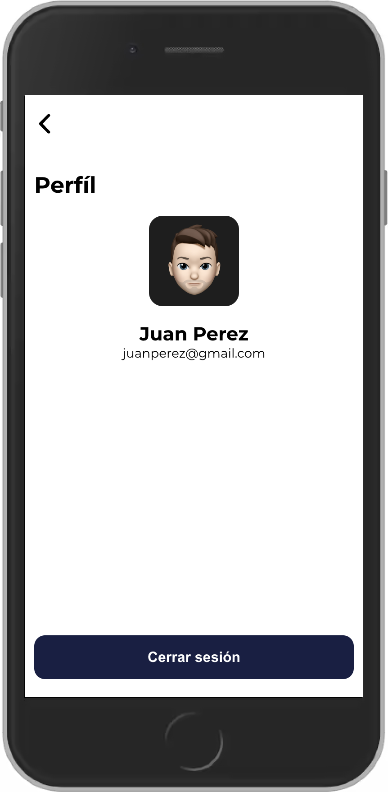
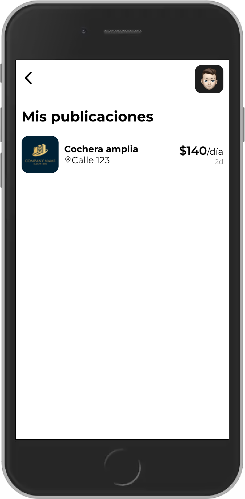

<div id="top"></div>

[![LinkedIn][linkedin-shield]][linkedin-url]

<!-- PROJECT LOGO -->
<br />
<div align="center">
  <a href="https://github.com/mocca-dev/gitsearch.git">
    
  </a>

<h3 align="center">GitSearch</h3>

  <p align="center">
    This is a simple React app to practice this type of interview excercises, including GraphQL.
    <br />
    <a href="https://lotapp.surge.sh/">View Demo</a>
  </p>
</div>

<div align="center">
  
</div>
<br>

<!-- TABLE OF CONTENTS -->
<details>
  <summary>Table of Contents</summary>
  <ol>
    <li>
      <a href="#about-the-project">About The Project</a>
      <ul>
        <li><a href="#built-with">Built With</a></li>
      </ul>
    </li>
    <li>
      <a href="#getting-started">Getting Started</a>
      <ul>
        <li><a href="#prerequisites">Installation and Startup</a></li>
      </ul>
    </li>
    <li><a href="#usage">Usage</a>
      <ul>
        <li><a href="#prerequisites">Load and play</a></li>
        <li><a href="#prerequisites">Settings</a></li>
      </ul>
    </li>
    <li><a href="#license">License</a></li>
    <li><a href="#contact">Contact</a></li>
  </ol>
</details>

<!-- ABOUT THE PROJECT -->

## About The Project

<div align="center">
  
</div>
<br>
<br>
<p>
  In this case I found a repo with an example of an interview-like exercise. The principal objective is to fetch data from the GraphQL GitHub API, specifically using the endpoint to search for users. Then list the result and finally if the user clicks in an item, the app route him to the profile screen.  
</p>
<p align="right">(<a href="#top">back to top</a>)</p>

### Built With

- [React.js ⚛️](https://reactjs.org/)
- [Redux Toolkit](https://redux-toolkit.js.org/)
- [Formik](https://formik.org/)
- [Yup](https://github.com/jquense/yup)
- [React-i18next](https://react.i18next.com/)
- [React Router](https://reactrouter.com/)

<p align="right">(<a href="#top">back to top</a>)</p>

<!-- GETTING STARTED -->

## Getting Started

This app is made with create-react-app so the installation process is simple.

### Installation and Startup

1. Clone the repo
   ```sh
   git clone https://github.com/mocca-dev/lot.git
   ```
2. Install NPM packages
   ```sh
   npm install
   ```
3. Finally you have to simply run the app and you're ready to go with the client.
   ```sh
   npm start
   ```

<p align="right">(<a href="#top">back to top</a>)</p>

<!-- USAGE EXAMPLES -->

## Usage

### Home

It's very straightfoward, just enter a GitHub username and click the search button.

### Signin Screen

<div align="center">
  
</div>
<br>
This is a very straightforward sign in screen, you enter your e-mail and password and click on "send" button. This is app is not a real life app so is all in "demo" mode. So, if you want to try it, you can sign in with demo@demo.com e-mail and demo password. <br>
Here you can see the "register" button, this feature isn't implemented yet.
<p align="right">(<a href="#top">back to top</a>)</p>

### Search Screen

<div align="center">
  
</div>
<br>
This is the main screen for this app. Here you can search for all the parking lots that are published. After doing the search you can enter in any of the parking lots to see more detail about it.
<p align="right">(<a href="#top">back to top</a>)</p>

### New Lot Screen

<div align="center">
  
</div>
<br>
If you want to post a parking lot you will have to how to the "New lot screen" clicking in the plus (+) icon in the footer bar. Here you can see the form to enter all the corresponding data of the new post. After filling up all the required data, you can click in the "post" button to confirm that you want to send the data and publish the new parking lot offer. 
<p align="right">(<a href="#top">back to top</a>)</p>

### Lot Screen

<div align="center">
  
</div>
<br>
If you click in some of the items from the result list, you will access to the "Lot" screen to see some details about the selected post. You will see the title, picture, address, contact info, the schedule, vehicle and cover type and the name of the owner. Bellow all of that a litle description too. <br>
In this screen you can do two actions, bookmark the post to see later and request the contact info. The idea is that when you enter the lot for the first time the telephone number is blocked by asterisks and if you want to access to that information you will need to click en the button on the bottom of the screen. A request will be sent to the owner of the post and then when he accept the request you will be abel to see the contact info.
<p align="right">(<a href="#top">back to top</a>)</p>

### Bookmarks Screen

<div align="center">
  
</div>
<br>
Here you can see the posts that you once bookmarked and access to them like you do in the search screen. 
<p align="right">(<a href="#top">back to top</a>)</p>

### Notifications Screen

<div align="center">
  
</div>
<br>
This screen will show you all the request that the users do over all your posts. Each item will contain the name of the user that made the request, the title of the post and the time since de request was made. <br>
From here you can choose either accept or deny each request separately. 
<p align="right">(<a href="#top">back to top</a>)</p>

### Menu

<div align="center">
  
</div>
<br>
When you click on the profile pic in the right corner of the screen you will open the menu to access to several options. The first one is the profile screen itself, then you have the "My Lots" screen. The third item in the menu is the abality to change the language of the entire app. The last one is the Sign Out button.
<p align="right">(<a href="#top">back to top</a>)</p>

### Profile Screen

<div align="center">
  
</div>
<br>
This is simply a profile screen to show you account info like name and e-mail. From here you can sign out.
<p align="right">(<a href="#top">back to top</a>)</p>

### My Lots Screen

<div align="center">
  
</div>
<br>
Until now this screen only lists all your posts to you know what you has been posted. The idea for this screen is that you can manage all your posts, that means, deleted, paused, edit. Those features will be added in the future.
<p align="right">(<a href="#top">back to top</a>)</p>

<!-- LICENSE -->

## License

Distributed under the MIT License. See `LICENSE.txt` for more information.

<p align="right">(<a href="#top">back to top</a>)</p>

<!-- CONTACT -->

## Contact

Nicolás Tonelli - nicolastonelli1406@gmail.com

Project Link: [https://github.com/mocca-dev/lot.git](https://github.com/mocca-dev/lot.git)

<p align="right">(<a href="#top">back to top</a>)</p>

<!-- MARKDOWN LINKS & IMAGES -->
<!-- https://www.markdownguide.org/basic-syntax/#reference-style-links -->

[contributors-shield]: https://img.shields.io/github/contributors/github_username/repo_name.svg?style=for-the-badge
[contributors-url]: https://github.com/github_username/repo_name/graphs/contributors
[forks-shield]: https://img.shields.io/github/forks/github_username/repo_name.svg?style=for-the-badge
[forks-url]: https://github.com/github_username/repo_name/network/members
[stars-shield]: https://img.shields.io/github/stars/github_username/repo_name.svg?style=for-the-badge
[stars-url]: https://github.com/github_username/repo_name/stargazers
[issues-shield]: https://img.shields.io/github/issues/github_username/repo_name.svg?style=for-the-badge
[issues-url]: https://github.com/github_username/repo_name/issues
[license-shield]: https://img.shields.io/github/license/github_username/repo_name.svg?style=for-the-badge
[license-url]: https://github.com/github_username/repo_name/blob/master/LICENSE.txt
[linkedin-shield]: https://img.shields.io/badge/-LinkedIn-black.svg?style=for-the-badge&logo=linkedin&colorB=555
[linkedin-url]: https://linkedin.com/in//nicolás-tonelli-181624b9/
[product-screenshot]: images/screenshot.png
